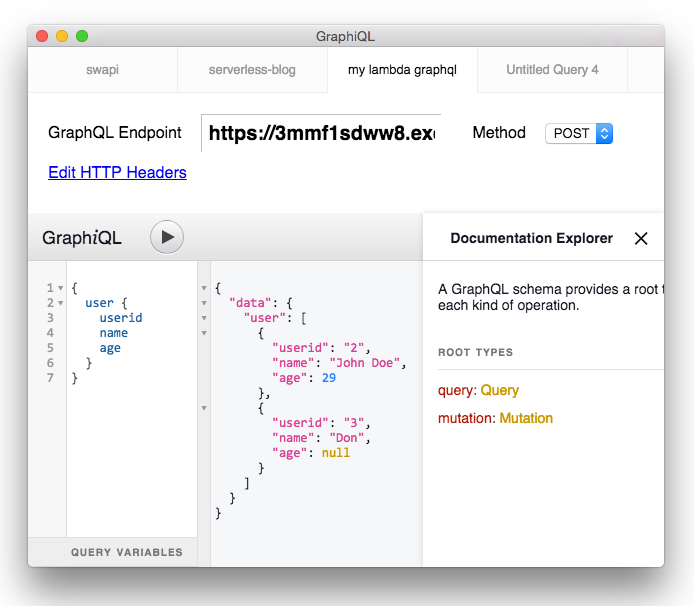

# GraphQL Endpoint, ES2015 and DynamoDB

Inspired by Kevin Old's [project](http://kevinold.com/2016/02/01/serverless-graphql.html),
this is a sample implementation
a [GraphQL](http://graphql.org/) service on AWS Lambda using Claudia. The service offers CRUD operations via just 1 endpoint. The data persistence is done via
DynamoDB, similar to the [dynamodb-example](https://github.com/claudiajs/example-projects/tree/master/dynamodb-example).
Additionally, this sample project is written in ES2015 and is transpiled by
[Babel](https://babeljs.io/) before uploading to AWS.

## Prerequisites

Create a table in DynamoDB, with a `string` primary key called `userid`. You can do that from the DynamoDB web console, or using the AWS CLI command line. Here is an example command that will create the table with the minimal provisioned throughput:

```bash
aws dynamodb create-table --table-name claudia-graphql-example \
  --attribute-definitions AttributeName=userid,AttributeType=S \
  --key-schema AttributeName=userid,KeyType=HASH \
  --provisioned-throughput ReadCapacityUnits=1,WriteCapacityUnits=1 \
  --query TableDescription.TableArn --output text
```

This example project includes an IAM access policy that will grant the lambda function access to all your DynamoDB tables, to make it easier to get started. If you wish, you can edit the [policies/access-dynamodb.json](policies/access-dynamodb.json) file and restrict the access to your new table only.

## Get started

To set this up, first [set up the credentials](https://github.com/claudiajs/claudia/blob/master/getting_started.md#configuring-access-credentials), then:

1. run `npm install` to grab the dependencies
2. run `npm run create` to create the lambda project under the default name on AWS.
3. run `./test/run.sh` to execute cURL scripts to test the CRUD operations against the lambda endpoint.

For subsequent updates, use the `npm run deploy` command.

## The API

With GraphQL, there is only 1 endpoint `/latest/graphql` for all CRUD operations. User construct a GraphQL query string based on the schema definition defined in `src/schema.js`, and post the string to the endpoint.


### Create and Update
Post `application/graphql` that looks like this:

```json
mutation {
  addUser (userid:"2", name:"John Doe", age:29) {
    userid
    name
    age
  }
}
```

### Read
Post `application/graphql` that looks like this:

```json
user (userid:"4") {
  userid
  name
  age
}
```

### DELETE
Post `application/graphql` that looks like this:

```json
mutation {
  deleteUser (userid:"4") {
    userid
    name
    age
  }
}

```

## Testing

### Via cURL
Run `./test/run.sh` to launch the cURL scripts that perform the various operations.

### Via GraphiQL
GraphiQL is an IDE that help user edit and test queries and discover the schema. You can download a GraphiQL app at https://github.com/skevy/graphiql-app



